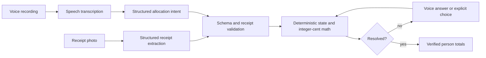

# Tabletalk

Tabletalk is a browser prototype for splitting a restaurant receipt from a photo and spoken instructions. It recognizes printed rows, keeps repeated items distinct, accepts corrections, asks about ambiguity, and shows final totals only after every item and receipt amount reconcile.

This repository was created for the supplied AI-First Product Builder assignment. It supports English, EUR, up to ten printed rows, three people, one shared item, and one clearly printed service charge.

## Run locally

Requirements: Node.js 22.13 or newer and a key for the configured OpenAI-compatible provider.

1. Copy `.env.example` to `.env` and set `OPENAI_API_KEY`. Keep it server-side; never use a `NEXT_PUBLIC_` name.
2. Install dependencies with `npm ci`.
3. Start the app with `npm run dev` and open `http://localhost:5173`.

Custom receipt uploads are always available. The selected image is kept if recognition fails; use **Retry recognition** after resolving the reported error. **Check connection** refreshes configuration without discarding the photo. A key must belong to a project with available API credit; `INSUFFICIENT_QUOTA` blocks both photo extraction and speech transcription. The labelled allocation example remains optional and is never presented as recognition evidence.

Run the checks with:

```text
npm run typecheck
npm test
npm run build
```

## Product flow

1. Add a clear JPG, PNG, or WebP receipt photo.
2. Check the recognized rows against the original image.
3. Edit the three names, choose **Start voice command**, allow microphone access, speak, then choose **Stop recording**. Alternatively upload an English voice recording.
4. Answer a focused clarification when an item or amount is ambiguous.
5. Review each row and the final totals. Export the session evidence when the split is settled.

The UI also permits explicit owner choices. These are the fallback for microphone denial, timeouts, or ambiguous repeated items; the user never types receipt rows or amounts into a form.

## Architecture



AI output is treated as a proposal. The server constrains responses to JSON schemas, then validates IDs, amounts, people, row limits, currency, repeated-item references, and supported sharing before state changes. Totals and service allocation never come from the model.

The main modules are:

- `lib/split.ts`: stable item IDs, state transitions, exact apportionment, settlement verification.
- `lib/intent.ts`: intent validation, repeated-item ambiguity guard, receipt confirmation application.
- `app/api/receipt/route.ts`: image extraction with uncertain values preserved as `null`.
- `app/api/voice/route.ts`: transcription followed by allocation-intent extraction.
- `lib/use-tabletalk.ts`: browser recording, corrections, undo, timing, cost and evidence export.

## Deterministic rules

- All money is a non-negative safe integer in minor currency units.
- A quantity row is expanded to stable unit IDs such as `r1.1` and `r1.2`.
- An assignment is an absolute replacement. Repeating a command is idempotent, and “the second coffee was Sam's” changes the existing second coffee instead of adding a charge.
- A shared item is split equally. For an indivisible cent, largest remainder allocation is used; ties follow the fixed left-to-right person order.
- Service charge is split in proportion to each person's item subtotal. Floors are assigned first, then remaining cents go to the largest fractional remainders; ties use the same person order.
- The split can settle only when all item units are allocated, uncertain receipt fields are confirmed, rows equal the printed subtotal, subtotal plus service equals the printed total, and person totals equal that total.
- The prototype enforces the assignment limit of one shared item.

## AI tools, models and reused components

- Current receipt vision and intent mapping: `gpt-5.6-sol` through RSI AI at `https://www.rsiai.net/v1/responses`, with strict structured output and local validation. The model and base URL are server configuration.
- Current speech-to-text: browser SpeechRecognition; final transcripts go to RSI AI for intent mapping. RSI AI has no channel for the tested transcription model. Recording upload is unavailable in browser mode. Direct OpenAI mode can use `gpt-4o-mini-transcribe`.
- Generated test receipt photos: OpenAI image generation. The photos are fictional and shareable.
- Synthetic test speech: Microsoft Zira Desktop through Windows System.Speech. The manifest records every utterance and identifies the recordings as synthetic.
- UI foundation: the supplied Vinext/React starter, Tailwind CSS, Radix-based components, Lucide icons, and Zod.

Own changes include the product interface, receipt and intent schemas, validation pipeline, allocation state, exact arithmetic, ambiguity rules, evidence logger, test fixtures, tests, and delivery documentation.

## Test set and results

Ground truth was saved in `evidence/expected-results.json` before the deterministic test run. Inputs live in `public/samples`.

| Scenario | Expected | Current verified result |
| --- | --- | --- |
| Normal | Alex €23.00, Sam €15.84, Lee €8.91 | Pass in deterministic core |
| Shared fries | Alex €18.82, Sam €17.93, Lee €11.00 | Pass in deterministic core and browser |
| Correction | Before: €21.90/€14.85/€11.00; after: €18.82/€17.93/€11.00 | Pass in deterministic core and browser |
| “Sam had a coffee” | Ask which coffee; do not silently allocate | Pass in intent validation |
| Obscured pasta price | Remain unsettled; ask for the amount or a clearer photo | Pass in deterministic core |

Fifteen deterministic and intent tests pass. The browser check covers allocation, exact totals, correction, hiding unresolved totals, undo, renaming people, and a 390 px mobile viewport with no horizontal overflow. The production build succeeds.

Live RSI AI image extraction passed for both reference and independent custom receipts. Normal, shared, correction, and ambiguous commands passed using supplied test transcripts. The unreadable price remained null. See evidence/live-recognition-results.json. These transcript tests do not verify microphone transcription.

## Measurement and cost

The app starts its timer when a photo flow or example begins and stops only when the split is settled. This includes user recording and clarification time. Every recognition operation stores model, status, latency, provider usage, estimated variable cost, and pricing basis. The evidence export includes failed calls, recordings, revisions, verification output, and time to the first and latest settled result.

Pricing assumptions recorded on 18 September 2026:

- GPT-4.1 mini: $0.40 per million input tokens, $0.10 cached input, $1.60 output.
- GPT-4o mini transcription: estimated $0.003 per audio minute.
- Speech output: $0 because the prototype uses text and explicit choices for clarifications.
- Paid recognition intermediaries: none.
- Hosting is reported separately and is not included in per-dialogue cost.

No live provider calls have been measured yet, so current actual AI spend is $0.00000 and is **not** a valid estimate of full operating cost. After configuring the key, run all five scenarios and export each session before submission. Failed-call cost remains unknown if the provider returns no usage; the export flags this instead of reporting a false zero.

## Known gaps before submission

- Configure the server key and run the sample photo, shared split, correction, ambiguity, and unreadable-photo scenarios through the live pipeline.
- Copy actual latency, token/audio usage, retries and cost from each exported session into the delivery notes.
- Test microphone permission and recording on the final HTTPS deployment.
- Record the three-minute walkthrough.
- Replace the current wall-clock evidence with an honest focused-work time log. Repository timestamps span 18–19 September and include inactive time, so they are not presented as focused hours.

See [DELIVERY.md](./DELIVERY.md) for the submission checklist and current expected/actual report.

## Custom receipt and voice verification

Run `node scripts/verify-recognition.mjs` while the server is running to call the real photo and voice routes (provider charges apply). It records results in `evidence/live-recognition-results.json`, including failures and usage. The independent input is `public/samples/custom-receipt.png`; expected amounts were recorded in `evidence/custom-receipt-expected.json` before testing.

The current run passed live receipt extraction and interpretation of supplied transcripts via RSI AI. Physical microphone transcription remains unverified. Microphone use requires localhost or HTTPS, browser speech support, and permission. Browser speech may send audio to the browser vendor. The API status checks configuration presence, not account billing or model access.

API formats follow the official [image input guide](https://developers.openai.com/api/docs/guides/images-vision) and [file transcription guide](https://developers.openai.com/api/docs/guides/speech-to-text).

## Provider configuration

For RSI AI, keep the key server-side in the ignored .env file and set:

```text
OPENAI_BASE_URL=https://www.rsiai.net/v1
OPENAI_MODEL=gpt-5.6-sol
SPEECH_MODE=browser
```

Browser speech submits final recognized words only; partial or cancelled speech never changes allocations. On browsers without SpeechRecognition, the app reports the limitation and the row controls remain usable. Recorded audio files are not interpreted in browser mode. API keys are never sent to the browser, and provider redirects are not followed.

RSI AI fees and browser speech costs are unverified. They are exported as null/unknown with provider identity and token usage, never as zero or as direct OpenAI pricing. The older OpenAI price assumptions above apply only when using the original direct OpenAI models.

## Real receipt templates

Choose **Browse receipt templates** in the empty state, or **Templates** beside an existing receipt. The three user-supplied photos have full previews and run through the same live recognition pipeline as uploads. They include unsupported currency/tax layouts and missing service details; they are not prefilled complete-split demos. See [template provenance and limitations](public/samples/templates/README.md), [expected results](evidence/template-expected-results.json), and [actual checks](evidence/template-actual-results.json).
